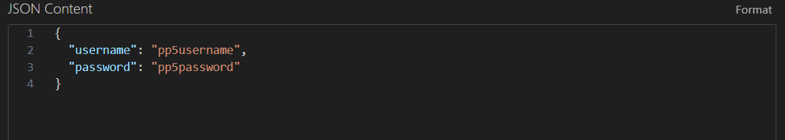

# PP5 Task Manager - Backend

## Overview

This is the **backend** of the PP5 Task Manager — a full-stack productivity web app for Code Institute’s Portfolio Project 5. Built using **Django** and **Django REST Framework**, the API handles all task-related data operations and authentication. The backend is protected using **Simple JWT** for secure, token-based access.

## Live API

[Render Backend Deployment](https://pp5-backend.onrender.com/api/)

Note: Requires frontend and valid credentials to use task endpoints.

## Features

- Token-based authentication using JSON Web Tokens (JWT)
- CRUD endpoints for task management
- Permissions to ensure users only access their own data
- CORS enabled for frontend integration
- Production-ready settings for PostgreSQL and Whitenoise
- Environment variables used for all secrets
- Clean 404 and 403 responses for unauthorized access

## Technologies Used

- Python 3 / Django 4
- Django REST Framework
- Simple JWT
- Gunicorn
- Whitenoise
- PostgreSQL-ready config
- Render (deployment)

## Setup Instructions

1. Clone the repository:
   ```bash
   git clone https://github.com/yourusername/pp5-backend.git
   cd pp5-backend
   ```

2. Create a `.env` file in the root:
   ```
   SECRET_KEY=your_secret_key
   DEBUG=False
   ALLOWED_HOSTS=pp5-backend.onrender.com,localhost,127.0.0.1
   ```

3. Install dependencies:
   ```bash
   pip install -r requirements.txt
   ```

4. Apply migrations:
   ```bash
   python manage.py migrate
   ```

5. Start local development server:
   ```bash
   python manage.py runserver
   ```

## API Endpoints

| Method | Endpoint                | Description                    |
|--------|-------------------------|--------------------------------|
| POST   | `/api/token/`           | Obtain access + refresh token |
| POST   | `/api/token/refresh/`   | Refresh expired access token  |
| GET    | `/api/tasks/`           | List all tasks for user       |
| POST   | `/api/tasks/`           | Create a new task             |
| PUT    | `/api/tasks/<id>/`      | Edit an existing task         |
| DELETE | `/api/tasks/<id>/`      | Delete a task                 |

All endpoints require authentication except `/api/token/` and `/api/token/refresh/`.

## Example: Token Login

Below is an example request body for obtaining a JWT token:



Response will include `access` and `refresh` tokens, which must be used in the `Authorization` header when accessing protected endpoints.

## User Stories

- As a developer, I want users to authenticate securely using JWT tokens.
- As a developer, I want to provide endpoints to create, read, update, and delete tasks.
- As a developer, I want to ensure that users can only access their own data.
- As a developer, I want the backend to integrate seamlessly with a React frontend.

## Testing

- Manual testing completed using Postman and curl
- All endpoints tested with valid and invalid tokens
- Validations and 403/404 errors confirmed
- Admin panel used for data verification
- Task creation and filtering tested across multiple accounts

## Assessment Coverage

| Requirement                          | Status                |
|--------------------------------------|------------------------|
| 3.1 Build backend for data records   | Complete              |
| 3.2 Custom task model with user FK   | Implemented           |
| 3.3 PEP8-compliant code              | Cleaned and verified  |
| 3.4 Python logic: views, permissions | Implemented using DRF |
| 3.5 DRF features: serializers, perms | Fully used            |
| 3.6 Working database and relations   | Verified via admin    |
| 3.7 Full CRUD via API                | Implemented           |
| 3.8 JWT login/register               | Implemented           |
| 3.9 Auth guards on all endpoints     | Enforced              |
| 3.10 Manual API testing              | Performed             |
| 3.11 Git and commit history          | Frequent, descriptive |
| 3.12 Deployed to cloud (Render)      | Live and stable       |
| 3.13 Secure deployment: DEBUG off    | Confirmed             |
| 3.14 Deployment process documented   | Included in README    |

## Deployment

- Deployed to **Render** using a `Procfile` and Gunicorn
- Environment variables added via Render dashboard
- `DEBUG` set to False for production
- Static files served with Whitenoise
- Final build mirrors local dev environment

## Author

Anders Langhoff